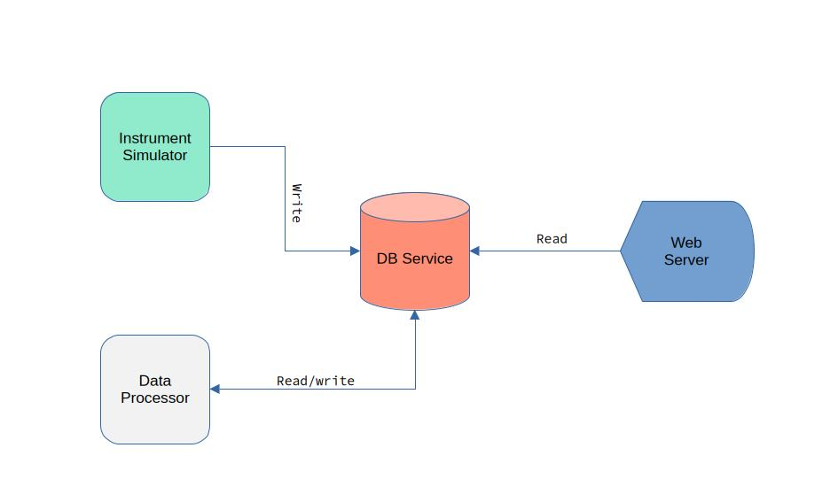

JHubDemoWebServer
-----------------

Web server for JuliaHub project deployment demos

- `bin/main.jl` is the entrypoint for execution on JuliaHub platform
- A `Manifest.toml` needs to be generated before deploying this project. You can generate a `Manifest.toml` file by instantiating the Project.toml locally or on the JuliaHub IDE (recommended) by clicking "Launch" on the project page. The julia version used for instantiation should match the version on JuliaHub.
- Recommended to use instance type with at least 8GB memory.
- Serves on port 8080 so mention that in the project deployment settings so that the port is proxied correctly.
- The DB service endpoint is hardcoded in src/WebServer.jl. Ideally this should be configured as an environment variable. Specifying environment variable is currently not possible for JuliaHub project deployments. **Make sure to edit this for your deployment see [DB Service](https://github.com/nkottary/JHubDemoInstrumentSimulator) for more details**.
